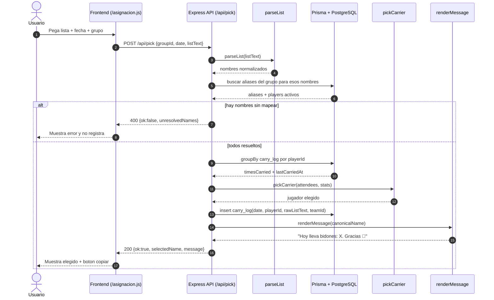
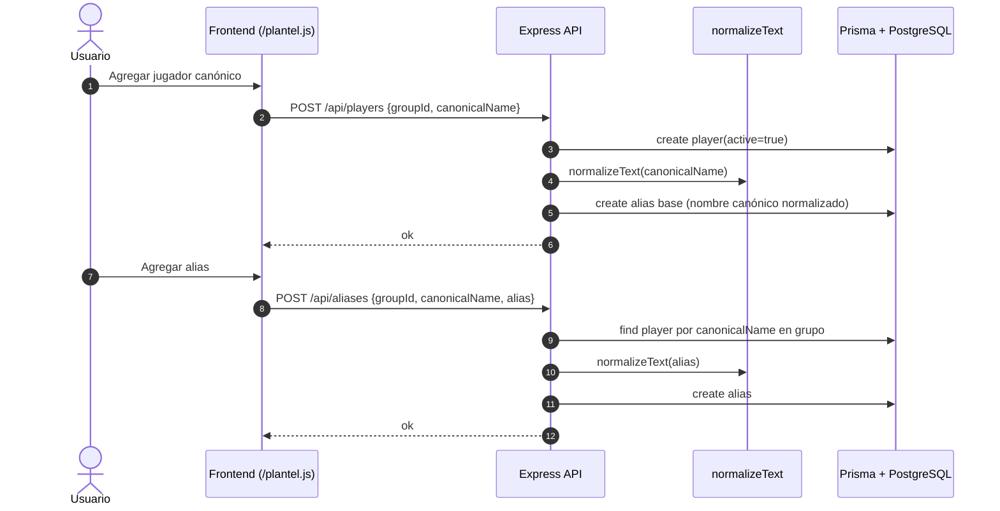

# Arquitectura Bidones

## Diagrama de clases

```mermaid
classDiagram
direction LR

class Team {
  +id: Int
  +name: String
  +active: Boolean
}

class Player {
  +id: Int
  +teamId: Int
  +canonicalName: String
  +active: Boolean
}

class Alias {
  +id: Int
  +teamId: Int
  +playerId: Int
  +aliasNormalized: String
}

class CarryLog {
  +id: Int
  +teamId: Int
  +date: String
  +playerId: Int
  +rawListText: String
  +createdAt: DateTime
}

class Normalize {
  +normalizeText(input): string
}

class ParseList {
  +parseList(rawText): ParsedName[]
}

class ResolvePlayers {
  +resolvePlayers(parsedNames, client): {resolved, unresolved}
}

class PickCarrier {
  +pickCarrier(attendees, client): PickResult
}

class RenderMessage {
  +renderMessage(canonicalName): string
}

class AppAPI {
  +POST /api/pick
  +GET /api/groups
  +POST /api/groups
  +GET /api/players
  +POST /api/players
  +POST /api/aliases
  +GET /api/history
  +DELETE /api/history
}

Team "1" --> "*" Player : contiene
Team "1" --> "*" Alias : contiene
Team "1" --> "*" CarryLog : contiene
Player "1" --> "*" Alias : tiene
Player "1" --> "*" CarryLog : registra

AppAPI ..> ParseList : usa
ParseList ..> Normalize : usa
ResolvePlayers ..> Alias : consulta
ResolvePlayers ..> Player : resuelve
AppAPI ..> PickCarrier : usa
AppAPI ..> RenderMessage : usa
```

## Diagrama de secuencia: asignacion (`POST /api/pick`)



## Diagrama de secuencia: gestion de plantel


